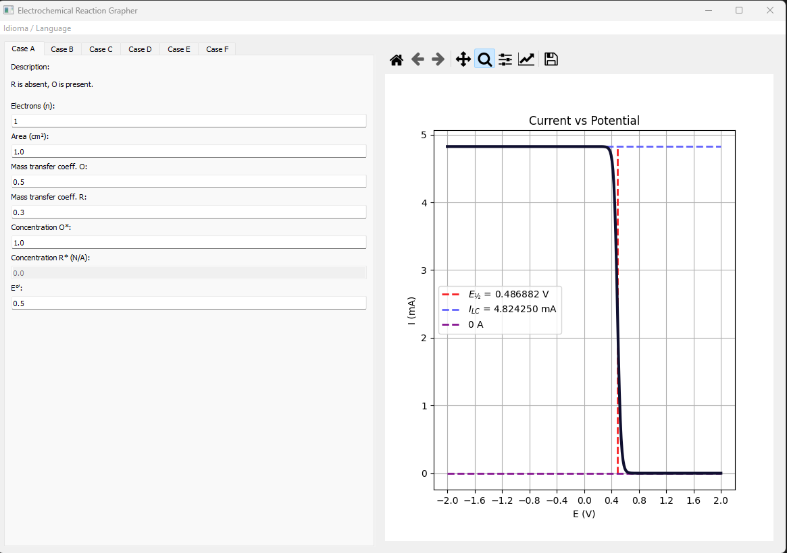
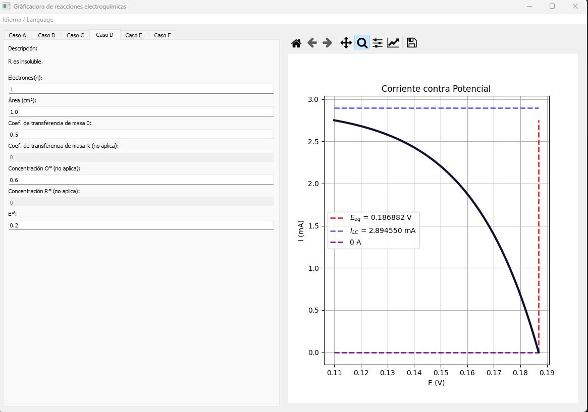

# ElectrochemGrapher

**ElectrochemGrapher** is a **Python + PyQt5** application that simulates and plots current–potential (I–E) curves based on the models presented in the early chapters of *Electrochemical Methods: Fundamentals and Applications (2nd Ed.)* by **Allen J. Bard** and **Larry R. Faulkner**.

> ⚡ This project was created as an educational tool to visualize different **electrochemical response cases**, helping students bridge theory and experimental intuition.

### Portable Windows executable

Download the `.exe` file from the [Releases](https://github.com/lmedinar/GUIElectrochem/releases) section.

---

## ✨ Key Features

- Simple and intuitive **graphical interface** (PyQt5).
- Simulation of **six classical cases** of electrochemical responses for solutions under constant agitation with different conditions for oxidants (O) and reductants (R):
  - **Case A:** R absent, O present.  
  - **Case B:** Both O and R present initially.  
  - **Case C:** R present, O absent.  
  - **Case D:** R insoluble.  
  - **Case E:** Complexing agent Y affects O (reversible reactions).  
  - **Case F:** Agent Y facilitates irreversible reactions.  
- Configurable parameters:
  - Number of electrons in the reaction (*n*).  
  - Electrode area.  
  - Mass transfer coefficients.  
  - Initial concentrations.  
  - Standard potential E°'.  
- Interactive **matplotlib plots** with automatic annotations of key parameters (e.g., $E_{1/2}$, $I_{LC}$).  
- **Bilingual interface**: Spanish and English.  
- Portable **Windows executable (.exe)** built with PyInstaller.  

---

## 🖼️ Screenshots

### Example: Case A


### Example: Case D


---

## 🚀 Installation & Usage

### From source
1. Clone the repository:
```bash
   git clone https://github.com/lmedinar/GUIElectrochem.git
   cd GUIElectrochem
```
2. Run the application:
```bash
python GUIElectrochem.py
  ```
---

## 📚 References

The theoretical foundation is based on:

**Allen J. Bard, Larry R. Faulkner**  
_Electrochemical Methods: Fundamentals and Applications_  
Second Edition. Wiley, 2000.  
ISBN 0-471-04372-9

---

## 🛠️ Technologies

- [Python 3.10+](https://www.python.org/)
    
- [PyQt5](https://riverbankcomputing.com/software/pyqt/intro)
    
- [Matplotlib](https://matplotlib.org/)
    
- [NumPy](https://numpy.org/)
    
- [PyInstaller](https://pyinstaller.org/) for Windows packaging
    

---

## 📄 License

This project is distributed under the MIT License.
